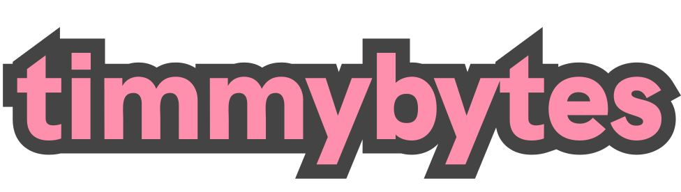

Hi, I'm Tim. I’m a **multidisciplinarian**, passionate about exploration and experimentation in a variety of fields. I thrive on using my technical and creative skill set to solve challenges and pursue lifelong learning.

<h2>developer</h2>

As a developer, I work with HTML, CSS, and React to create frontend applications, as well as a variety of other tools and frameworks. I’m also partial to working with the command line, and automating tasks with shell scripts.

<h2>designer</h2>

I’m passionate about clean, meaningful design to communicate ideas in the simplest ways, with experience creating logos and branding, graphics, typographically-focused layouts, and album artwork.

<h2>writer</h2>

I’ve written and presented academic literary criticism, media reviews and studies, technical documentation, product copy, and blog posts over the years. You can keep up with my current writing at my [blog](https://timmybytes.com/blog).

<h2>musician</h2>

For nearly twenty years I’ve been a songwriter, collaborator, performer, and recording musician. I’m currently part of [Animal Politik](https://animalpolitik.org) as a lead songwriter, singer, and guitarist, and tinker with other instrumentation.

  

    
    
    
  

  <h2>Activity</h2>
  

    
  

  <h2>Projects</h2>
  

    
    
    
        
  

