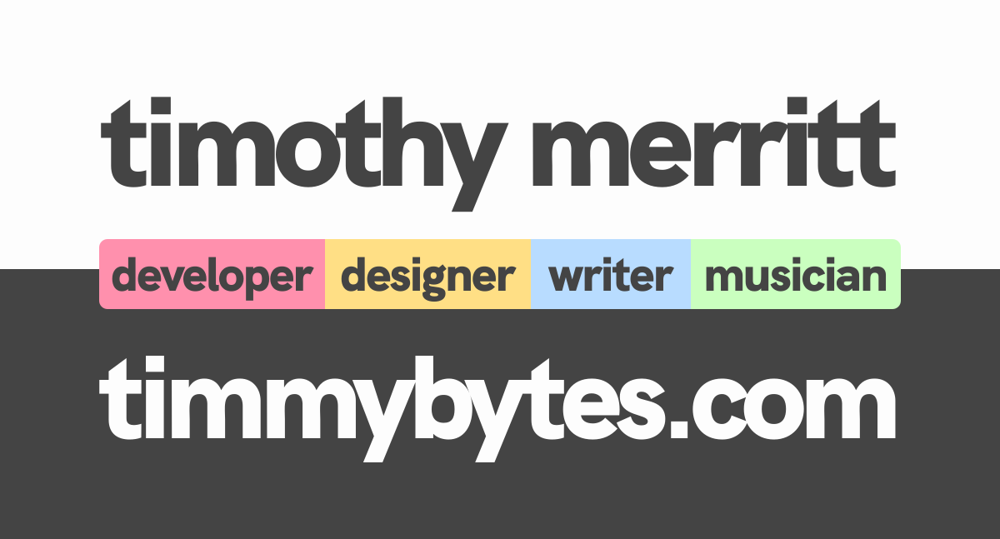

<h1>
  
</h1>

<h3>Hi! I'm Tim</h3>

I’m a **multidisciplinarian** passionate about making, exploring, and
experimenting in a variety of creative fields. I'm a developer primarily working
with React, but I also do design work, writing, and music. You can learn more
about me and read my writing at [timmybytes.com](https://timmybytes.com), or
connect with me on the sites below!

  

    
    
    
  

  <h2>Activity</h2>
  

    
  

  <h2>Projects</h2>
  

    
    
    
        
  

