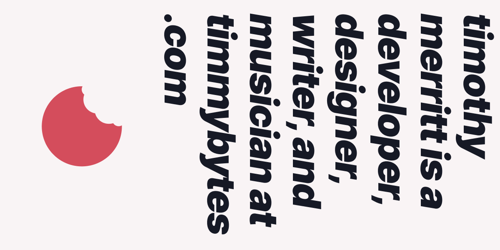

<h1>
  
</h1>

<h3>Hi! I'm Tim</h3>

I’m a passionate multidisciplinarian who loves building things with code.

  

    
    
    
  

  <h2>Stats</h2>
  

    
    
  

  <h2>Projects</h2>
  

    
    
    
        
  

