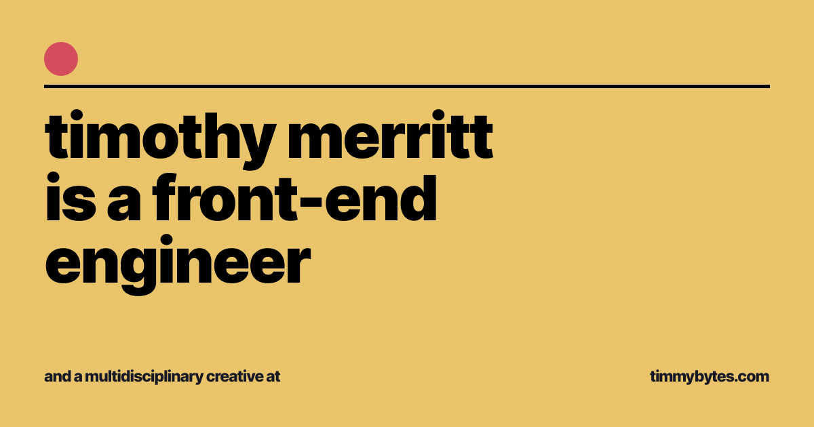

<!-- TODO: Add new color palette -->

<h1>
  
  <!-- RED: D14046 -->
  <!-- WHITE: FFFCF4 -->
  <!-- BLACK: 34333E -->
    
    

    

    
    
  

<!--

  <h2>Projects</h2>
  

    
    
    
        
  

 -->
